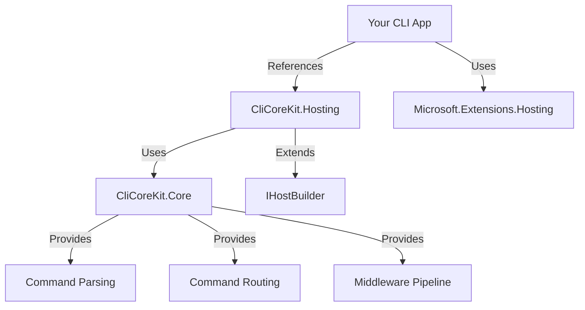

# CliCoreKit

[](https://dotnet.microsoft.com/)
[](LICENSE)

A powerful and flexible command-line parsing library for .NET 10 with full integration with `Microsoft.Extensions.Hosting`, dependency injection, and middleware pipeline support.

## Features

- **Modern .NET 10** - Built for the latest .NET platform
- **Multiple Parsing Styles** - Supports POSIX (`-v`), GNU (`--verbose`), and Windows (`/v`) style arguments
- **Hierarchical Commands** - Create nested subcommands like `git remote add`
- **IHostBuilder Integration** - Seamless integration with .NET Generic Host
- **Dependency Injection** - Full DI support for commands and services
- **Middleware Pipeline** - Extensible middleware system following Open/Closed Principle (SOLID)
- **Type-Safe Parsing** - Strongly-typed argument parsing with validation
- **Fluent API** - Clean and intuitive configuration syntax

## Architecture



## Installation

```bash
dotnet add package Monbsoft.CliCoreKit.Core
dotnet add package Monbsoft.CliCoreKit.Hosting
```

## Quick Start

### 1. Create a Simple Command

```csharp
using Monbsoft.CliCoreKit.Core;

public class GreetCommand : ICommand
{
    public Task<int> ExecuteAsync(CommandContext context, CancellationToken cancellationToken = default)
    {
        var name = context.GetOptionValue("name") ?? "World";
        Console.WriteLine($"Hello, {name}!");
        return Task.FromResult(0);
    }
}
```

### 2. Configure Your CLI Application

```csharp
using Microsoft.Extensions.Hosting;
using Monbsoft.CliCoreKit.Hosting;

var host = Host.CreateDefaultBuilder(args)
    .ConfigureCli(cli =>
    {
        cli.AddCommand<GreetCommand>("greet", "Greet a user")
           .UseValidation();
    })
    .Build();

return await host.RunCliAsync(args);
```

### 3. Run Your Application

```bash
dotnet run -- greet --name John
# Output: Hello, John!
```

## Usage Examples

### Command-Line Argument Styles

CliCoreKit supports multiple argument parsing styles:

```bash
# POSIX style (short options)
myapp -v -f file.txt

# GNU style (long options)
myapp --verbose --file file.txt

# Windows style
myapp /verbose /file file.txt

# Combined short options
myapp -vrf file.txt  # Equivalent to -v -r -f file.txt

# Long option with equals
myapp --file=file.txt

# Mixed styles
myapp --verbose -o output.txt file1.txt file2.txt
```

### Hierarchical Subcommands

Create complex command structures like `git`:

```csharp
host.ConfigureCli(cli =>
{
    // Root command
    cli.AddCommand<GitCommand>("git", "Version control system");

    // Subcommands
    cli.AddSubCommand<CommitCommand>("commit", "git", "Record changes");
    cli.AddSubCommand<PushCommand>("push", "git", "Update remote refs");

    // Nested subcommands
    cli.AddSubCommand<RemoteCommand>("remote", "git", "Manage remotes");
    cli.AddSubCommand<RemoteAddCommand>("add", "git.remote", "Add remote");
});
```

Usage:
```bash
myapp git commit -m "Initial commit"
myapp git remote add origin https://github.com/user/repo.git
```

### Dependency Injection

Commands automatically support constructor injection:

```csharp
public class DataCommand : ICommand
{
    private readonly ILogger<DataCommand> _logger;
    private readonly IDataService _dataService;

    public DataCommand(ILogger<DataCommand> logger, IDataService dataService)
    {
        _logger = logger;
        _dataService = dataService;
    }

    public async Task<int> ExecuteAsync(CommandContext context, CancellationToken cancellationToken)
    {
        _logger.LogInformation("Fetching data...");
        var data = await _dataService.GetDataAsync(cancellationToken);

        Console.WriteLine($"Retrieved {data.Count} items");
        return 0;
    }
}
```

Register your services:

```csharp
var host = Host.CreateDefaultBuilder(args)
    .ConfigureServices((context, services) =>
    {
        services.AddSingleton<IDataService, DataService>();
        services.AddLogging();
    })
    .ConfigureCli(cli =>
    {
        cli.AddCommand<DataCommand>("data", "Fetch data");
    })
    .Build();
```

### Middleware Pipeline

Add cross-cutting concerns using middleware:

```csharp
public class LoggingMiddleware : ICommandMiddleware
{
    private readonly ILogger<LoggingMiddleware> _logger;

    public LoggingMiddleware(ILogger<LoggingMiddleware> logger)
    {
        _logger = logger;
    }

    public async Task<int> InvokeAsync(
        CommandContext context,
        Func<CommandContext, CancellationToken, Task<int>> next,
        CancellationToken cancellationToken = default)
    {
        _logger.LogInformation("Executing command: {CommandName}", context.CommandName);
        var stopwatch = Stopwatch.StartNew();

        var result = await next(context, cancellationToken);

        stopwatch.Stop();
        _logger.LogInformation("Command completed in {ElapsedMs}ms with exit code {ExitCode}",
            stopwatch.ElapsedMilliseconds, result);

        return result;
    }
}
```

Register middleware:

```csharp
cli.UseMiddleware<LoggingMiddleware>()
   .UseValidation();
```

### Argument Parsing

Access parsed arguments in your commands:

```csharp
public Task<int> ExecuteAsync(CommandContext context, CancellationToken cancellationToken)
{
    // Check if option exists
    bool verbose = context.HasOption("verbose") || context.HasOption("v");

    // Get option value
    string? output = context.GetOptionValue("output");

    // Get typed value
    if (context.TryGetOption<int>("port", out var port))
    {
        Console.WriteLine($"Using port: {port}");
    }

    // Get positional arguments
    var file1 = context.GetPositional(0);
    var file2 = context.GetPositional(1);

    // Get all positional arguments
    foreach (var file in context.Positional)
    {
        Console.WriteLine($"Processing: {file}");
    }

    return Task.FromResult(0);
}
```

## Advanced Configuration

### Custom Argument Parser Options

```csharp
var parserOptions = new ArgumentParserOptions
{
    AllowWindowsStyle = true,
    AllowCombinedShortOptions = true
};

var parser = new ArgumentParser(parserOptions);
var router = new CommandRouter(registry, parser);
```

### Command Validation

Define option requirements:

```csharp
var definition = new CommandDefinition
{
    Name = "deploy",
    CommandType = typeof(DeployCommand),
    Options = new List<OptionDefinition>
    {
        new()
        {
            Name = "environment",
            ShortName = 'e',
            Description = "Target environment",
            IsRequired = true,
            ValueType = typeof(string)
        },
        new()
        {
            Name = "force",
            ShortName = 'f',
            Description = "Force deployment",
            IsRequired = false
        }
    }
};
```

### Manual Command Registration

For advanced scenarios, you can manually configure commands:

```csharp
cli.ConfigureCommands((serviceProvider, registry) =>
{
    var definition = new CommandDefinition
    {
        Name = "custom",
        Description = "Custom command with complex setup",
        CommandType = typeof(CustomCommand),
        Options = new List<OptionDefinition>
        {
            new() { Name = "option1", IsRequired = true }
        }
    };

    registry.Register(definition);
});
```

## Project Structure

```
CliCoreKit/
├── src/
│   ├── CliCoreKit.Core/           # Core parsing and command infrastructure
│   │   ├── ICommand.cs
│   │   ├── ArgumentParser.cs
│   │   ├── CommandRegistry.cs
│   │   ├── CommandRouter.cs
│   │   ├── Middleware/
│   │   └── Validation/
│   └── CliCoreKit.Hosting/        # IHostBuilder extensions
│       ├── CliHostBuilder.cs
│       ├── HostBuilderExtensions.cs
│       └── CliHostedService.cs
├── tests/
│   ├── CliCoreKit.Core.Tests/
│   └── CliCoreKit.Hosting.Tests/
├── samples/
│   └── CliCoreKit.Sample/         # Example application
└── README.md
```

## Design Principles (SOLID)

This library follows SOLID principles:

- **Single Responsibility**: Each class has one clear purpose
- **Open/Closed**: Extensible via middleware without modifying core
- **Liskov Substitution**: Interface-based design allows substitution
- **Interface Segregation**: Focused interfaces (ICommand, ICommandMiddleware)
- **Dependency Inversion**: Depends on abstractions, not concretions

## Testing

Run unit tests:

```bash
dotnet test
```

The project includes comprehensive tests for:
- Argument parsing (POSIX, GNU, Windows styles)
- Command registry and routing
- Nested subcommands
- Host builder integration
- Middleware pipeline

## Contributing

Contributions are welcome! Please feel free to submit a Pull Request.

## License

This project is licensed under the MIT License - see the [LICENSE](LICENSE) file for details.

## Author

**Monbsoft**

## Acknowledgments

Built with:
- [.NET 10](https://dotnet.microsoft.com/)
- [Microsoft.Extensions.Hosting](https://docs.microsoft.com/en-us/dotnet/core/extensions/generic-host)
- [xUnit](https://xunit.net/) for testing
- [FluentAssertions](https://fluentassertions.com/) for test assertions

---

For more examples, see the [samples directory](./samples/CliCoreKit.Sample/).